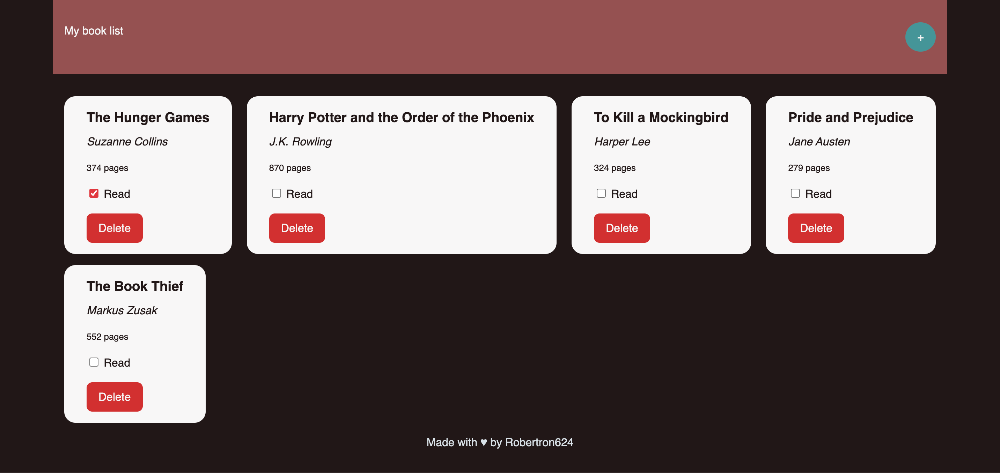

# The Odin Project - Book Library

## Description

This is a project that is part of the Javascript Path in [The Odin Project](https://www.theodinproject.com/).
 
 
This is a simple book library app that allows you to add books to a list and mark them as read or not read. It also allows you to remove books from the list. To check the project description, please visit [The Odin Project](https://www.theodinproject.com/lessons/node-path-javascript-library#project-solution).

## Built With

- HTML
- CSS
- Javascript

That's it, no frameworks or libraries.

## Live Demo

[Live Demo Link](https://rawcdn.githack.com/brugobi/book-library/0b9b9b9b1b2b3b0b9b9b9b9b9b9b9b9b9b9b9b9/index.html)

## Screenshot

